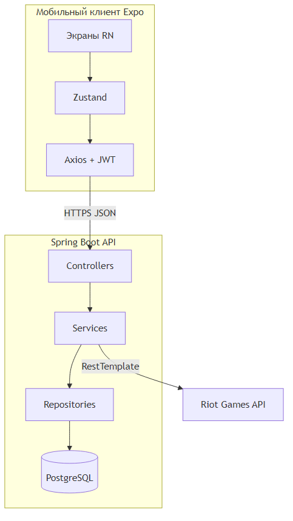
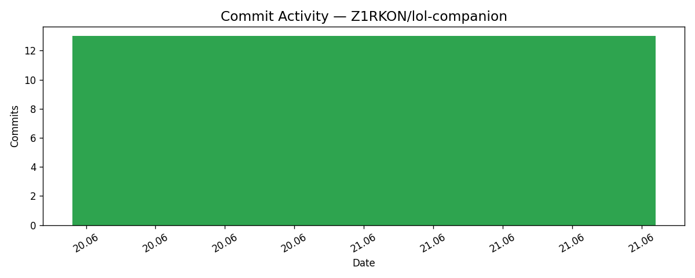
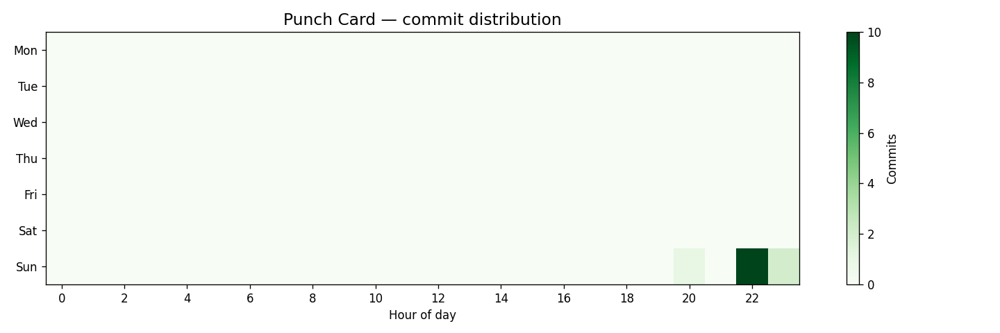

# LoL Companion

**Автор:** Орлов Владимир Алексеевич  
**Группа:** ПИЖ-б-о-23-2(2)  
**Траектория:** В — Мобильная разработка (React Native + Spring Boot)  
**Репозиторий:** https://github.com/Z1RKON/lol-companion

## Описание проекта

LoL Companion — мобильное приложение-компаньон для League of Legends. Позволяет искать призывателей по Riot ID, просматривать ранг, винрейт и историю матчей, вести список избранных игроков и привязывать собственный Riot-аккаунт. Серверная часть интегрируется с Riot Games API и кэширует данные в PostgreSQL.

## Траектория выполнения

- [ ] Десктоп
- [ ] Веб
- [x] **Мобильная** (React Native + Spring Boot)
- [ ] Enterprise

## Технологический стек

| Компонент | Технология |
|-----------|------------|
| Backend | Java 17, Spring Boot 3.3, PostgreSQL, Flyway |
| Mobile | React Native (Expo), TypeScript, Zustand |
| API | REST, JWT (JJWT) |
| Внешний API | Riot Games API |
| Безопасность | BCrypt, Spring Security |
| Тесты | JUnit 5, Mockito, JaCoCo, Jest |
| Сборка | Gradle, npm |

## Требования к окружению

| Требование | Версия |
|------------|--------|
| Java JDK | 17+ |
| Node.js | 18+ |
| PostgreSQL | 14+ |
| Android Studio | для эмулятора |

## Установка и запуск

### 1. Клонирование

```bash
git clone https://github.com/Z1RKON/lol-companion.git
cd lol-companion
```

### 2. Backend

```powershell
# PostgreSQL: создать БД lol_companion_db
cd backend
copy .env.example .env
# Заполнить RIOT_API_KEY, JWT_SECRET, DB_PASSWORD
cd ..
.\start-lol-companion.ps1
```

API: `http://localhost:8080/api`  
Swagger UI: `http://localhost:8080/api/swagger-ui/index.html`

### 3. Mobile

```powershell
cd mobile
npm install
npm run android
```

## API Endpoints

Базовый URL: `http://localhost:8080/api`

| Метод | Путь | Описание |
|-------|------|----------|
| POST | /auth/register | Регистрация |
| POST | /auth/login | Вход (JWT) |
| GET | /summoner/search | Поиск по Riot ID |
| GET | /summoner/{puuid} | Профиль |
| GET | /summoner/{puuid}/matches | Матчи |
| POST | /summoner/favorites | Избранное |
| … | … | **16 эндпоинтов** |

Полная документация: [docs/09-api/REST-ENDPOINTS.md](docs/09-api/REST-ENDPOINTS.md)

## Архитектура (PCMEF)

| Слой | Расположение |
|------|--------------|
| Presentation | React Native (mobile) |
| Control | Spring @RestController |
| Mediator | @Service, RiotApiClient |
| Entity | JPA @Entity |
| Foundation | @Repository, config |



Документация: [docs/02-architecture/arc42-overview.md](docs/02-architecture/arc42-overview.md)

## Структура документации

| Этап | Папка |
|------|-------|
| 0. Инициация | [docs/00-project-charter/](docs/00-project-charter/) |
| 1. Требования | [docs/01-requirements/](docs/01-requirements/) |
| 2. Архитектура | [docs/02-architecture/](docs/02-architecture/) |
| 3. БД | [docs/03-database/](docs/03-database/) |
| 4. Проектирование | [docs/04-detailed-design/](docs/04-detailed-design/) |
| 5. Реализация | [docs/05-implementation/](docs/05-implementation/) |
| 6. Тестирование | [docs/06-testing/](docs/06-testing/) |
| 7. Рефакторинг | [docs/07-refactoring/](docs/07-refactoring/) |
| 8. UI | [docs/08-ui/](docs/08-ui/) |
| 9. API | [docs/09-api/](docs/09-api/) |
| 10. Развёртывание | [docs/10-deployment/](docs/10-deployment/) |
| 11. Руководство | [docs/11-user-guide/](docs/11-user-guide/) |
| 12. Отчёт | [docs/12-final-report/](docs/12-final-report/) |

Полный индекс: [docs/README.md](docs/README.md)

## Статистика разработки

### Метрики Git

| Метрика | Значение |
|---------|----------|
| Всего коммитов | 13 |
| Период | 21.06.2026 20:19 — 21.06.2026 23:00 |
| Покрытие JaCoCo | ≥ 40% (фактически ~61%) |
| Покрытие Jest | ≥ 40% (фактически ~43%) |

### График активности



### Тепловая карта (Punch Card)



## Автор

Орлов Владимир Алексеевич — группа ПИЖ-б-о-23-2(1), orlov1771@yandex.ru, GitHub: [Z1RKON](https://github.com/Z1RKON)
