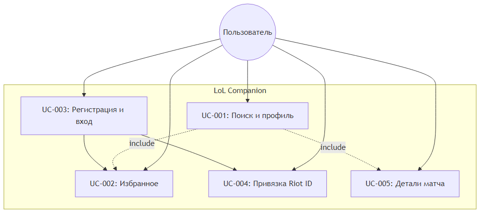

# Диаграмма бизнес-вариантов использования (BUC)

BUC описывает взаимодействие **актора** (игрок LoL) с системой на уровне бизнес-процессов, без детализации технических шагов.

## Актор

| Актор | Описание |
|-------|----------|
| Игрок LoL | Пользователь мобильного приложения, ищет статистику призывателей |

## Бизнес-варианты использования

| ID | BUC | Описание |
|----|-----|----------|
| BUC-01 | Управление учётной записью | Регистрация, вход, привязка Riot ID |
| BUC-02 | Поиск игрока | Поиск призывателя по Riot ID и региону |
| BUC-03 | Анализ статистики | Просмотр ранга, винрейта, истории матчей |
| BUC-04 | Ведение избранного | Добавление и удаление игроков из списка |

## Диаграмма

Рисунок 2 — Диаграмма вариантов использования (детализация UC см. [01-requirements/use-case-diagram.md](../01-requirements/use-case-diagram.md))

## Связь BUC → UC

| BUC | Use Cases |
|-----|-----------|
| BUC-01 | UC-01 Регистрация, UC-02 Вход, UC-07 Привязка Riot ID |
| BUC-02 | UC-03 Поиск призывателя |
| BUC-03 | UC-04 Просмотр профиля, UC-05 Детали матча |
| BUC-04 | UC-06 Избранное |
