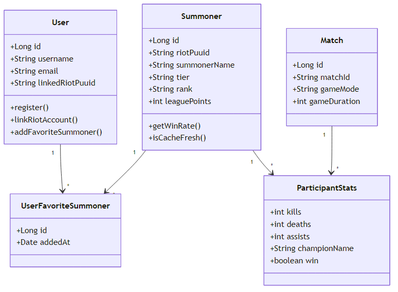

# Бизнес-классы (концептуальный уровень)

Концептуальные классы предметной области до разбиения на технические слои PCMEF.

## Классы

| Класс | Ответственность |
|-------|-----------------|
| **Игрок (User)** | Учётная запись в приложении, аутентификация, привязка Riot ID |
| **Призыватель (Summoner)** | Игрок LoL во внешней системе Riot; ранг, LP, винрейт |
| **Матч (Match)** | Завершённая игра: режим, длительность, участники |
| **Участник (ParticipantStats)** | Статистика призывателя в конкретном матче |
| **Избранное (UserFavoriteSummoner)** | Связь пользователя с отслеживаемым призывателем |

## Диаграмма

Рисунок 3 — Доменная модель

## Бизнес-правила

1. Riot ID уникален в паре (имя, тег, регион) — идентификатор PUUID.
2. Избранное доступно только авторизованному пользователю.
3. Данные призывателя кэшируются; при устаревании — обновление из Riot API.
4. Поиск требует валидного формата `Имя#Тег`.

## Детализация

- [domain-model.md](../01-requirements/domain-model.md)
- [class-diagram.md](../04-detailed-design/class-diagram.md)
