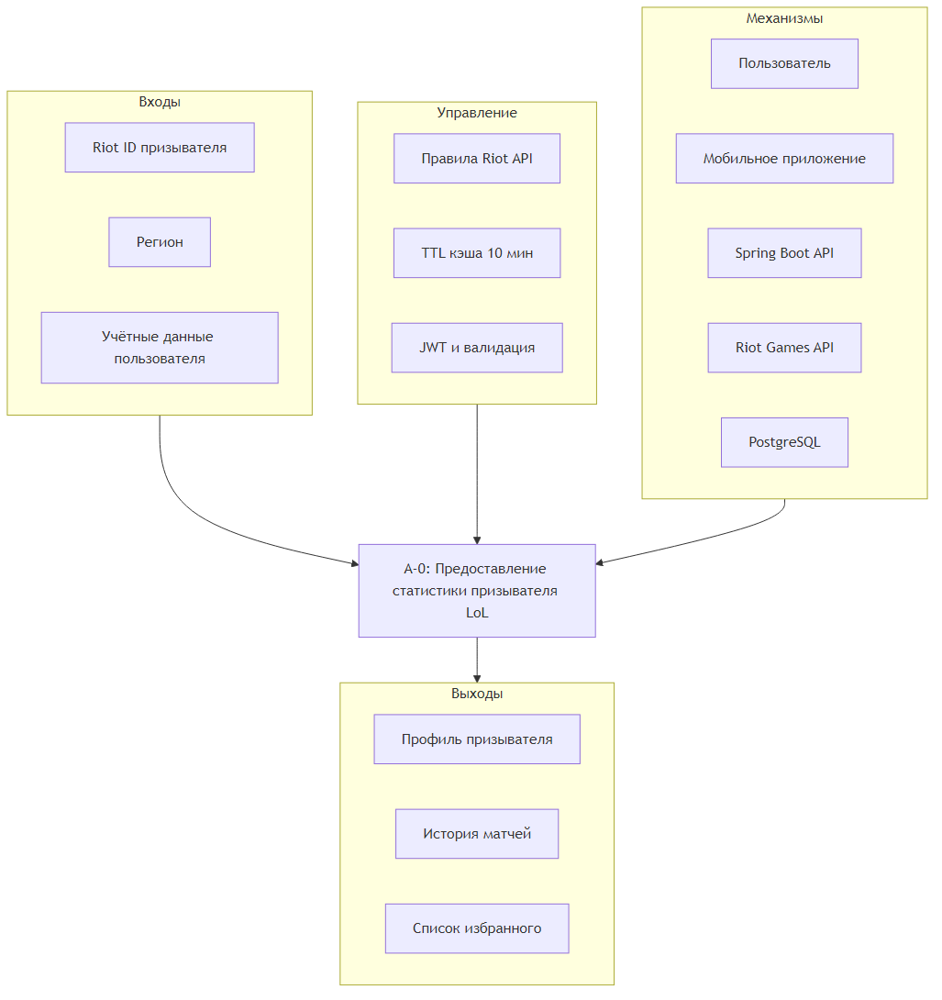

# Диаграмма бизнес-контекста (IDEF0 A-0)

Функциональный блок A-0: **«Предоставление статистики призывателя LoL»**.

Рисунок 1 — Контекстная диаграмма IDEF0

## Входы

- Riot ID призывателя (Имя#Тег)
- Регион (RU, EUW, NA и др.)
- Учётные данные пользователя приложения

## Управление

- Правила Riot Games API (rate limit, формат Riot ID)
- TTL кэша профиля (10 минут)
- JWT и валидация входных данных

## Механизмы

- Пользователь мобильного приложения
- Сервер Spring Boot
- Riot Games API
- PostgreSQL

## Выходы

- Профиль призывателя (уровень, ранг, LP, винрейт)
- История матчей и детали матча
- Список избранных игроков
