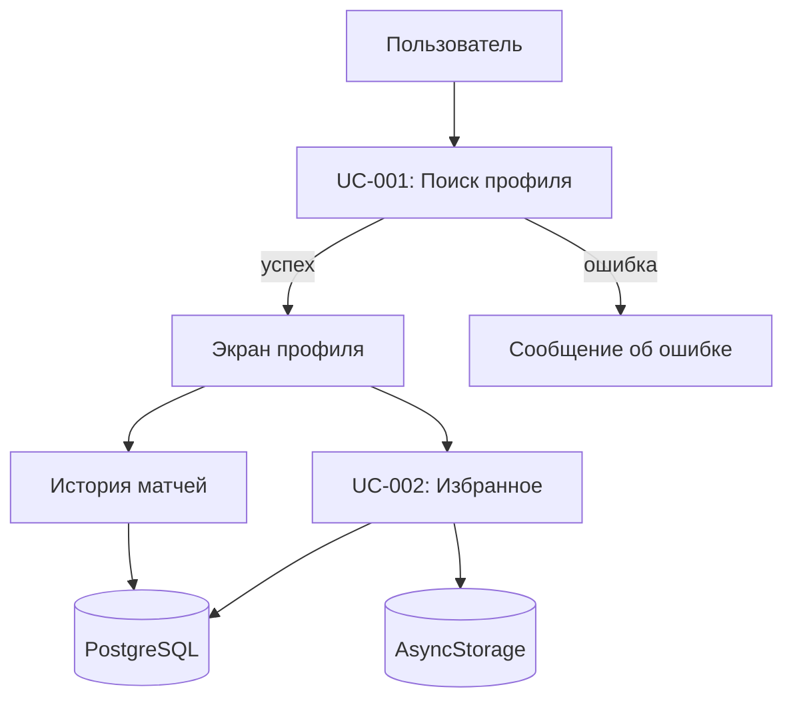

# Системные прецеденты (Use Cases)

**Стандарт оформления:** текстовое описание по ГОСТ 34.602-89 / ГОСТ Р ИСО/МЭК 19510 (вариант «сценарий использования»).  
**Система:** мобильное приложение-компаньон LoL (React Native + Spring Boot, PCMEF, Riot Games API).

---

## UC-001. Поиск и просмотр профиля призывателя (интеграция бэкенда с Riot API)

| Поле | Значение |
|------|----------|
| **Идентификатор** | UC-001 |
| **Наименование** | Поиск и просмотр профиля призывателя |
| **Краткое описание** | Пользователь вводит игровое имя призывателя; мобильный клиент запрашивает бэкенд; бэкенд при необходимости обращается к Riot API, сохраняет/обновляет данные в PostgreSQL и возвращает профиль (уровень, регион, ранг, винрейт) для отображения. |

### Основной актор

**Пользователь мобильного приложения** — инициатор поиска (игрок LoL или зритель статистики).

### Вторичные акторы

- **Сервер приложения (Spring Boot)** — Control/Mediator/Foundation.
- **Riot Games API** — внешний поставщик данных об аккаунте и лигах.

### Предусловия

1. Мобильное приложение установлено и запущено.
2. У пользователя есть сетевое соединение с сервером приложения.
3. Сервер приложения запущен и доступен.
4. На сервере задан действующий ключ `RIOT_API_KEY` и регион по умолчанию.
5. Сервисы Riot API в выбранном регионе доступны (нет плановых простоев).

### Основной сценарий

| Шаг | Действие |
|-----|----------|
| 1 | Пользователь открывает экран поиска призывателя. |
| 2 | Пользователь вводит игровое имя и подтверждает поиск (кнопка «Найти» / аналог). |
| 3 | Клиент (Presentation) проверяет, что строка не пустая (формат Riot ID: **Имя#Тег**, до 22 символов). |
| 4 | Клиент отправляет HTTP-запрос: `GET /api/summoner/search?name={riotId}&region={RU|EUW|...}` (через Axios, заголовок JWT). |
| 5 | Контроллер (Control) валидирует параметры и вызывает `SummonerService.getSummonerProfileByName(name, region)`. |
| 6 | Сервис (Mediator) ищет призывателя в PostgreSQL по имени (без учёта регистра). |
| 7 | Если запись найдена и кэш актуален (TTL ≤ 10 минут), сервис возвращает данные из БД **без** вызова Riot API. |
| 8 | Если записи нет или кэш устарел, сервис через `RiotApiClient` запрашивает аккаунт в Riot API (получение PUUID, уровня, иконки профиля). |
| 9 | Сервис запрашивает у Riot API данные ранговой лиги (tier, rank, LP, статистика побед/поражений) и вычисляет винрейт. |
| 10 | Сервис сохраняет или обновляет сущность `Summoner` в PostgreSQL и устанавливает `lastUpdated`. |
| 11 | Контроллер формирует `SummonerResponseDto` и возвращает ответ `HTTP 200` с JSON-телом. |
| 12 | Клиент переходит на экран профиля с параметром маршрута `puuid` (ник отображается из ответа API). |
| 13 | Клиент при успехе может сохранить краткий снимок ответа в `AsyncStorage` для офлайн-просмотра (опционально, TTL на клиенте ~5 минут). |
| 14 | Пользователь просматривает профиль; при необходимости запрашивает историю матчей (`GET /api/summoner/{puuid}/matches`) — отдельное расширение функционала в рамках того же прецедента просмотра. |

### Расширения (альтернативные сценарии и ошибки)

**1а. Пустое или некорректное имя на клиенте**

| Шаг | Действие |
|-----|----------|
| 1а.1 | На шаге 3 клиент обнаруживает пустую строку или только пробелы. |
| 1а.2 | Клиент показывает сообщение: «Введите игровое имя призывателя»; запрос на бэкенд не выполняется. |
| 1а.3 | Сценарий возвращается к шагу 2. |

**1б. Некорректный параметр на бэкенде**

| Шаг | Действие |
|-----|----------|
| 1б.1 | На шаге 5 контроллер получает `name`, не прошедший валидацию (пустой после trim). |
| 1б.2 | Возвращается `HTTP 400 Bad Request`. |
| 1б.3 | Клиент отображает сообщение о некорректном вводе; сценарий возвращается к шагу 2. |

**1в. Призыватель не найден в Riot API**

| Шаг | Действие |
|-----|----------|
| 1в.1 | На шаге 8 Riot API возвращает `404`. |
| 1в.2 | Mediator выбрасывает `SummonerNotFoundException`. |
| 1в.3 | `GlobalExceptionHandler` формирует ответ: `HTTP 404`, код `SUMMONER_NOT_FOUND`, текст с указанием имени и региона. |
| 1в.4 | Клиент показывает уведомление: призыватель не найден; пользователь уточняет имя/регион. |
| 1в.5 | Сценарий возвращается к шагу 2. |

**1г. Превышен лимит запросов Riot API**

| Шаг | Действие |
|-----|----------|
| 1г.1 | На шаге 8 или 9 Riot API возвращает `429 Too Many Requests`. |
| 1г.2 | Обрабатывается `RiotRateLimitException`; ответ `HTTP 429`, код `RATE_LIMIT_EXCEEDED`. |
| 1г.3 | Клиент предлагает повторить запрос позже (с учётом `Retry-After`, если передан). |
| 1г.4 | Сценарий завершается неуспешно; пользователь может повторить с шага 2. |

**1д. Ошибка Riot API или сбой интеграции**

| Шаг | Действие |
|-----|----------|
| 1д.1 | На шагах 8–9 возникает `RiotApiException` (5xx, таймаут, неверный ключ). |
| 1д.2 | Handler возвращает соответствующий HTTP-код и структурированное тело ошибки. |
| 1д.3 | Клиент отображает сообщение о временной недоступности внешнего сервиса. |

**1е. Недоступность бэкенда**

| Шаг | Действие |
|-----|----------|
| 1е.1 | На шаге 4 клиент не получает ответ (таймаут, `5xx`, отказ соединения). |
| 1е.2 | Клиент показывает: «Сервер временно недоступен» с возможностью повтора. |
| 1е.3 | Сценарий возвращается к шагу 2. |

**1ж. Отсутствие сети на устройстве**

| Шаг | Действие |
|-----|----------|
| 1ж.1 | На шаге 4 Axios фиксирует сетевую ошибку. |
| 1ж.2 | Клиент предлагает проверить подключение и повторить поиск. |
| 1ж.3 | При наличии устаревшего кэша в `AsyncStorage` клиент может отобразить последний сохранённый профиль с пометкой «данные могут быть устаревшими». |

**1з. Успешный просмотр из кэша БД (ветвление основного сценария)**

| Шаг | Действие |
|-----|----------|
| 1з.1 | На шаге 7 условие свежести кэша выполнено. |
| 1з.2 | Выполнение переходит с шага 7 на шаг 11 (без шагов 8–10). |

### Постусловия

**При успехе:**

- В PostgreSQL актуализирована запись `Summoner` с PUUID, уровнем, регионом и данными ранга.
- Пользователь видит экран профиля призывателя.
- В журнале сервера зафиксирован факт обращения (логирование).

**При неуспехе:**

- Состояние БД не ухудшается (транзакция откатывается при ошибке сохранения).
- Пользователь информирован о причине (не найден, лимит API, сеть, сервер).
- Повторный поиск возможен без перезапуска приложения.

---

## UC-002. Добавление игрока в список избранного для быстрого отслеживания

| Поле | Значение |
|------|----------|
| **Идентификатор** | UC-002 |
| **Наименование** | Добавление игрока в список избранного |
| **Краткое описание** | После просмотра профиля пользователь сохраняет призывателя в избранное для быстрого доступа к карточке и обновлению статистики без повторного ввода имени; данные сохраняются на сервере (PostgreSQL) и дублируются в локальном хранилище клиента. |

### Основной актор

**Пользователь мобильного приложения** — владелец списка избранного.

### Вторичные акторы

- **Сервер приложения** — персистентное хранение связи `User` — `Summoner`.
- **Локальное хранилище (AsyncStorage)** — кэш списка избранного на устройстве.

### Предусловия

1. Выполнен прецедент UC-001: профиль отображён, известен `puuid` (призыватель уже есть в БД после поиска).
2. Пользователь **аутентифицирован** (JWT); избранное привязано к `User` на бэкенде.
3. Призыватель ещё не находится в избранном данного пользователя.
4. Сервер приложения и БД PostgreSQL доступны (для серверного варианта сохранения).

### Основной сценарий

| Шаг | Действие |
|-----|----------|
| 1 | Пользователь на экране профиля нажимает элемент «Добавить в избранное» (иконка «сердце» / кнопка). |
| 2 | Клиент отправляет `POST /api/summoner/favorites` с телом `{ "puuid": "<puuid>" }`. |
| 3 | Контроллер валидирует запрос и вызывает `FavoriteService.addFavorite(userId, puuid)`. |
| 4 | Сервис находит `Summoner` в БД по PUUID; при отсутствии — `404 SUMMONER_NOT_FOUND`. |
| 5 | Сервис создаёт запись `UserFavoriteSummoner` (уникальность пары `user_id` + `summoner_id`, лимит 50). |
| 6 | Бэкенд возвращает `HTTP 201 Created` с `FavoriteSummonerDto`. |
| 7 | Клиент обновляет список избранного (`useFavoritesStore.loadFavorites`). |
| 8 | UI показывает «Добавлено в избранное»; на экране «Избранное» открытие профиля — по `puuid`. |

### Расширения (альтернативные сценарии и ошибки)

**2а. Призыватель уже в избранном (повторное нажатие — снятие)**

| Шаг | Действие |
|-----|----------|
| 2а.1 | На шаге 1 пользователь нажимает элемент в состоянии «В избранном». |
| 2а.2 | Клиент отправляет `DELETE /api/summoner/favorites/{summonerId}`. |
| 2а.3 | Сервис удаляет запись `UserFavoriteSummoner`. |
| 2а.4 | Клиент удаляет элемент из `AsyncStorage`, UI переходит в состояние «Добавить в избранное»; уведомление «Удалено из избранного». |

**2б. Дубликат при добавлении (гонка или повтор запроса)**

| Шаг | Действие |
|-----|----------|
| 2б.1 | На шаге 6 срабатывает ограничение уникальности `uk_user_summoner`. |
| 2б.2 | Сервис возвращает `HTTP 409 Conflict`, код `FAVORITE_ALREADY_EXISTS`. |
| 2б.3 | Клиент синхронизирует UI: отображает состояние «В избранном» без дублирования в списке. |

**2в. Превышен лимит избранного**

| Шаг | Действие |
|-----|----------|
| 2в.1 | На шаге 6 бизнес-правило отклоняет добавление (например, более 50 записей на пользователя). |
| 2в.2 | Возвращается `HTTP 400`, код `BUSINESS_RULE_VIOLATION` (текст про лимит 50). |
| 2в.3 | Клиент показывает: «Достигнут лимит избранного. Удалите игрока из списка». |

**2г. Призыватель не найден в БД и не может быть создан**

| Шаг | Действие |
|-----|----------|
| 2г.1 | На шаге 5 отсутствует `Summoner` и не удаётся восстановить данные по PUUID. |
| 2г.2 | Возвращается `HTTP 404`, код `SUMMONER_NOT_FOUND`. |
| 2г.3 | Клиент предлагает сначала выполнить поиск профиля (UC-001). |

**2д. Ошибка записи в AsyncStorage**

| Шаг | Действие |
|-----|----------|
| 2д.1 | На шаге 9 локальное сохранение завершается исключением. |
| 2д.2 | Данные на сервере остаются сохранёнными; клиент показывает предупреждение о рассинхронизации и повторяет загрузку списка с бэкенда. |

**2е. Бэкенд недоступен; локальный режим (опционально)**

| Шаг | Действие |
|-----|----------|
| 2е.1 | На шаге 3 запрос к серверу не выполнен. |
| 2е.2 | Клиент сохраняет запись только в `AsyncStorage` с флагом `pendingSync: true`. |
| 2е.3 | При восстановлении сети клиент повторяет шаги 3–8 (фоновая синхронизация). |

**2ж. Пользователь не аутентифицирован**

| Шаг | Действие |
|-----|----------|
| 2ж.1 | На шаге 3 отсутствует идентификатор `User`. |
| 2ж.2 | Клиент перенаправляет на экран входа/регистрации или сохраняет избранное локально до входа. |

### Постусловия

**При успехе:**

- В PostgreSQL создана связь `UserFavoriteSummoner` с полем `addedAt`.
- Список избранного загружается с сервера при открытии вкладки.
- UI отражает статус «В избранном»; призыватель доступен с экрана «Избранное».

**При удалении (расширение 2а):**

- Связь удалена из БД и локального кэша; UI в состоянии «не в избранном».

---

## Связь прецедентов

## Связанные документы

- [Бизнес-глоссарий](../00-project-charter/glossary.md)
- [Спецификация методов](../04-detailed-design/method-specifications.md)
- [Настройка Riot API](../05-setup/RIOT-API-SETUP.md)
