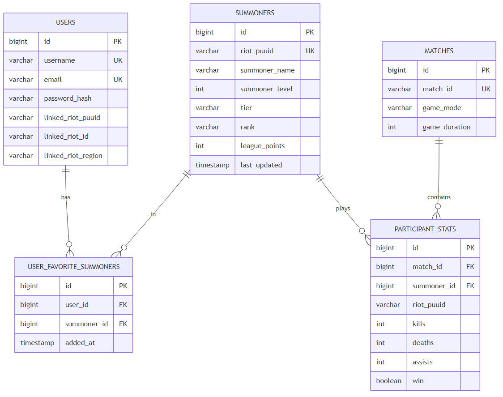

# ER-диаграмма

Рисунок 5 — Логическая модель данных

## Таблицы

| Таблица | Назначение |
|---------|------------|
| users | Учётные записи приложения, привязка Riot ID |
| summoners | Кэш профилей LoL (`riot_puuid` UNIQUE) |
| matches | Кэш матчей (immutable после загрузки) |
| participant_stats | KDA, чемпион, win per match |
| user_favorite_summoners | M:N user ↔ summoner |
| champion_stats | Агрегат по чемпионам (опционально) |

## Индексы

- `idx_users_username`
- `idx_summoners_riot_puuid`
- `idx_summoners_summoner_name`

## Нормализация

Схема приведена к 3НФ: неключевые атрибуты зависят только от первичного ключа.
