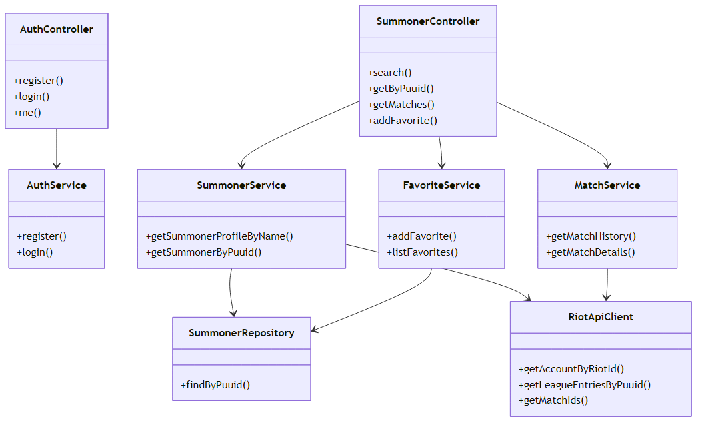

# Диаграмма классов проектирования

Рисунок 8 — Классы по слоям PCMEF

## Control

- `AuthController` — register, login, me, riot-account
- `SummonerController` — search, matches, favorites, refresh

## Mediator

- `AuthService`, `SummonerService`, `MatchService`, `FavoriteService`, `UserRiotService`
- `RiotApiClient` — фасад над Riot API

## Entity

- `User`, `Summoner`, `Match`, `ParticipantStats`, `UserFavoriteSummoner`

## Foundation

- `UserRepository`, `SummonerRepository`, `MatchRepository`
- `JwtService`, `SecurityConfig`
