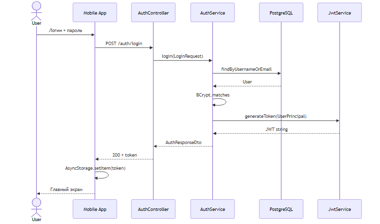

# Диаграммы последовательности

## UC-001: Поиск профиля

Рисунок 6 — Поиск призывателя (Cache-Aside)

1. Mobile → `GET /summoner/search?name=&region=`
2. SummonerController → SummonerService
3. Поиск в PostgreSQL; при устаревшем кэше → RiotApiClient
4. Save → DTO → navigate Profile(puuid)

## UC-002: Добавление в избранное

Рисунок 7 — Добавление в избранное

1. POST `/summoner/favorites` `{ puuid }`
2. FavoriteService → findByPuuid → проверка дубликата → save

## UC-003: Аутентификация

Рисунок 18 — Вход пользователя (JWT)

1. POST `/auth/login` → AuthService.login
2. BCrypt.matches → JwtService.generateToken
3. Mobile сохраняет токен в AsyncStorage
4. Axios interceptor добавляет `Authorization: Bearer`

Спецификация методов: [method-specifications.md](method-specifications.md)
