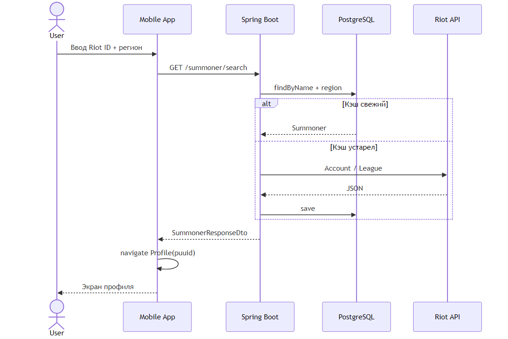
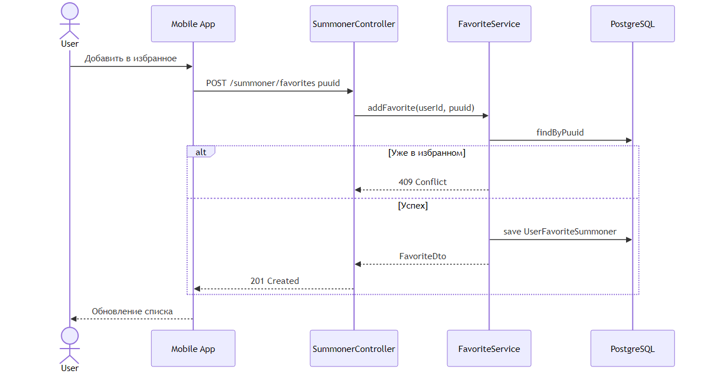

# Диаграммы последовательности

## UC-001: Поиск профиля

Рисунок 6 — Поиск призывателя (Cache-Aside)

1. Mobile → `GET /summoner/search?name=&region=`
2. SummonerController → SummonerService
3. Поиск в PostgreSQL; при устаревшем кэше → RiotApiClient
4. Save → DTO → navigate Profile(puuid)

## UC-002: Добавление в избранное

Рисунок 7 — Добавление в избранное

1. POST `/summoner/favorites` `{ puuid }`
2. FavoriteService → findByPuuid → проверка дубликата → save

## UC-003: Аутентификация

1. POST `/auth/login` → JwtService.generateToken
2. Mobile сохраняет токен в AsyncStorage
3. Axios interceptor добавляет `Authorization: Bearer`
