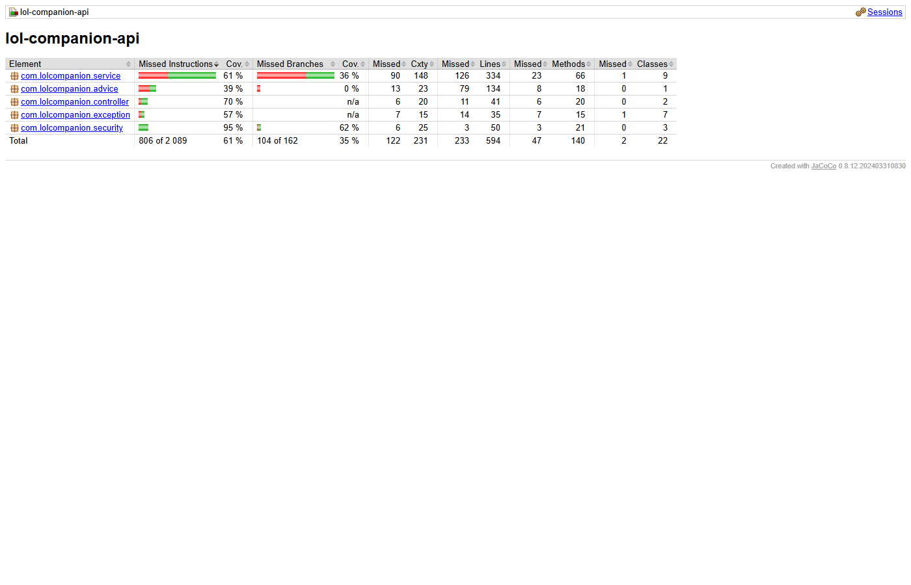
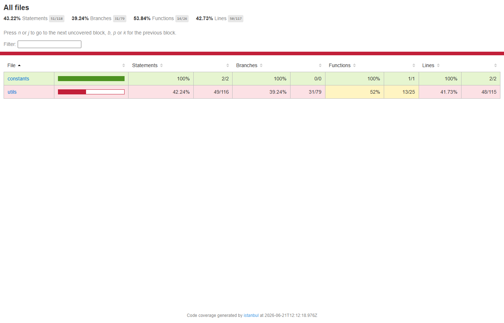

# Отчёт о покрытии кода

## Backend (JaCoCo)

Рисунок 15 — Отчёт JaCoCo

| Метрика | Значение |
|---------|----------|
| Порог | ≥ 40% instruction coverage |
| Фактически | ~61% (бизнес-слой) |
| Тестов | 66 |

Отчёт: `backend/build/reports/jacoco/test/html/index.html`

## Mobile (Jest / Istanbul)

Рисунок 16 — Отчёт Jest

| Метрика | Значение |
|---------|----------|
| Порог | ≥ 40% lines (utils, constants) |
| Фактически | ~43% |
| Тестов | 15 |

Отчёт: `mobile/coverage/lcov-report/index.html` после `npm run test:coverage`

## Аудит PCMEF

[COMPLIANCE-AUDIT](../12-final-report/compliance/COMPLIANCE-AUDIT.md)
