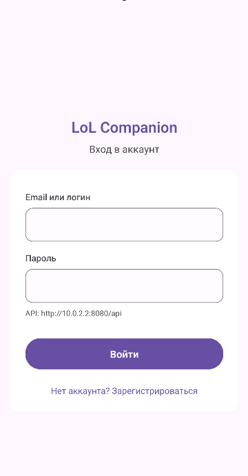
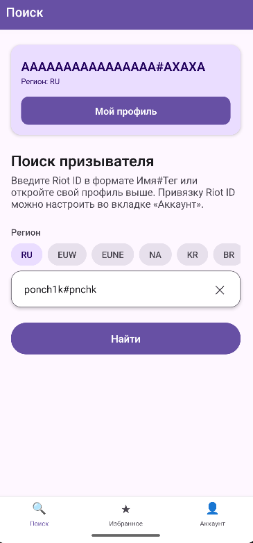
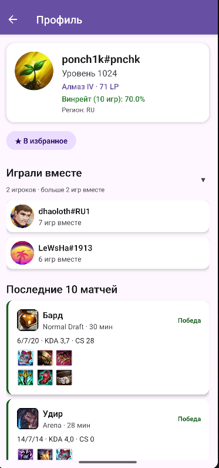
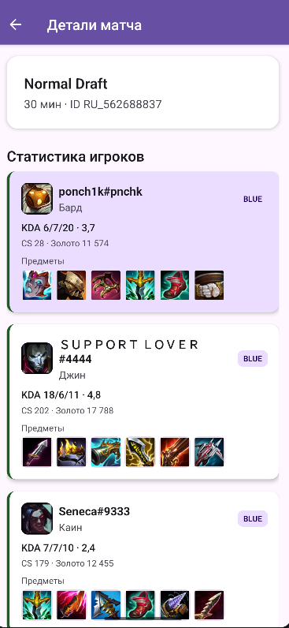
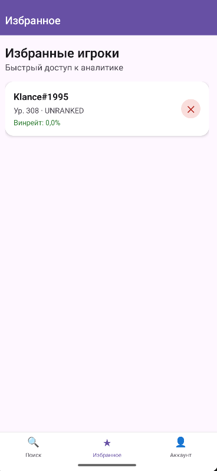
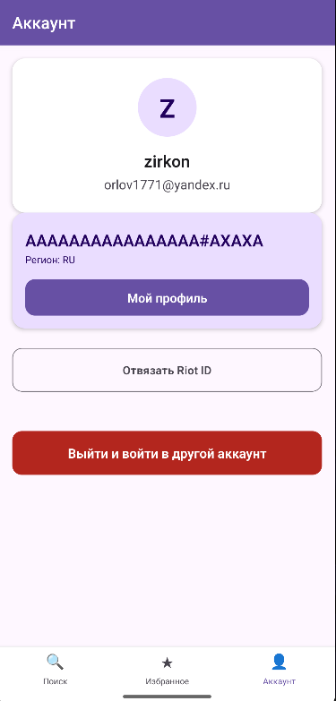

# Мобильный интерфейс (траектория В)

Требование методички: **минимум 5 экранов**. Реализовано **6 экранов**.

| № | Экран | Файл | Назначение |
|---|-------|------|------------|
| 1 | Вход | LoginScreen | Регистрация, вход, JWT |
| 2 | Поиск | SearchScreen | Riot ID, регион, свой профиль |
| 3 | Профиль | ProfileScreen | Ранг, матчи, избранное, союзники |
| 4 | Избранное | FavouritesScreen | Список по PUUID |
| 5 | Аккаунт | AccountScreen | Привязка Riot ID, выход |
| 6 | Детали матча | MatchDetailScreen | KDA, чемпионы, предметы |

## Скриншоты

Рисунок 9 — Экран входа

Рисунок 10 — Экран поиска

Рисунок 11 — Профиль призывателя

Рисунок 12 — Детали матча

Рисунок 13 — Избранное

Рисунок 14 — Аккаунт

## Требования UI (методичка)

- [x] Сетевое взаимодействие с REST API (Axios)
- [x] Состояния: загрузка, ошибка, пусто
- [x] Локальное кэширование (AsyncStorage)
- [x] Навигация (React Navigation)
- [x] FlatList для списка матчей
- [x] Валидация ввода (SearchInput)
