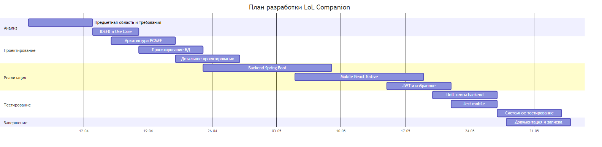

# Пояснительная записка

## Содержание записки

1. Введение, актуальность, цель
2. Аналитическая часть (IDEF0, SWOT, аналоги)
3. Проектная часть (Use Case, PCMEF, ER, sequence)
4. Реализация (backend, mobile)
5. Тестирование (JaCoCo, Jest)
6. Развёртывание, WBS, Гант
7. Заключение, источники

## Диаграмма Ганта

Рисунок 17 — План разработки
